<a href="https://colab.research.google.com/github/pachterlab/BLCSBGLKP_2020/blob/master/notebooks/diagnostic.ipynb" target="_parent"></a>


```python

```

# Diagnostic results


```python
!git clone https://github.com/pachterlab/BLCSBGLKP_2020.git
```

    Cloning into 'BLCSBGLKP_2020'...
    remote: Enumerating objects: 186, done.
    remote: Counting objects: 100% (186/186), done.
    remote: Compressing objects: 100% (171/171), done.
    remote: Total 186 (delta 57), reused 75 (delta 10), pack-reused 0
    Receiving objects: 100% (186/186), 34.16 MiB | 25.95 MiB/s, done.
    Resolving deltas: 100% (57/57), done.


```python
!pip install anndata
```

    Collecting anndata
    [?25l  Downloading https://files.pythonhosted.org/packages/5b/c8/5c594a95ba293433dfe1cf188075ccbabe495bf2d291be744974aca85ffc/anndata-0.7.1-py3-none-any.whl (97kB)
         |████████████████████████████████| 102kB 3.7MB/s 
    [?25hRequirement already satisfied: importlib-metadata>=0.7; python_version < "3.8" in /usr/local/lib/python3.6/dist-packages (from anndata) (1.6.0)
    Requirement already satisfied: pandas>=0.23.0 in /usr/local/lib/python3.6/dist-packages (from anndata) (1.0.3)
    Requirement already satisfied: natsort in /usr/local/lib/python3.6/dist-packages (from anndata) (5.5.0)
    Requirement already satisfied: packaging in /usr/local/lib/python3.6/dist-packages (from anndata) (20.3)
    Requirement already satisfied: scipy~=1.0 in /usr/local/lib/python3.6/dist-packages (from anndata) (1.4.1)
    Requirement already satisfied: numpy~=1.14 in /usr/local/lib/python3.6/dist-packages (from anndata) (1.18.4)
    Requirement already satisfied: h5py in /usr/local/lib/python3.6/dist-packages (from anndata) (2.10.0)
    Requirement already satisfied: zipp>=0.5 in /usr/local/lib/python3.6/dist-packages (from importlib-metadata>=0.7; python_version < "3.8"->anndata) (3.1.0)
    Requirement already satisfied: python-dateutil>=2.6.1 in /usr/local/lib/python3.6/dist-packages (from pandas>=0.23.0->anndata) (2.8.1)
    Requirement already satisfied: pytz>=2017.2 in /usr/local/lib/python3.6/dist-packages (from pandas>=0.23.0->anndata) (2018.9)
    Requirement already satisfied: six in /usr/local/lib/python3.6/dist-packages (from packaging->anndata) (1.12.0)
    Requirement already satisfied: pyparsing>=2.0.2 in /usr/local/lib/python3.6/dist-packages (from packaging->anndata) (2.4.7)
    Installing collected packages: anndata
    Successfully installed anndata-0.7.1


# Obtain diagnostic results from the adata


```python
import pandas as pd
import numpy as np
import matplotlib.pyplot as plt
import string
import anndata

from collections import defaultdict
from collections import OrderedDict


from mpl_toolkits.axes_grid1 import make_axes_locatable
import matplotlib as mpl
import matplotlib.patches as mpatches


from sklearn.manifold import TSNE
from sklearn.cluster import KMeans
from sklearn.preprocessing import scale
from sklearn.preprocessing import normalize
from sklearn.decomposition import TruncatedSVD
from sklearn.linear_model import LogisticRegression
from sklearn.model_selection import train_test_split
from sklearn import metrics
from scipy.special import expit as sigmoid

def nd(arr):
    return np.asarray(arr).reshape(-1)

def yex(ax):
    lims = [
        np.min([ax.get_xlim(), ax.get_ylim()]),  # min of both axes
        np.max([ax.get_xlim(), ax.get_ylim()]),  # max of both axes
    ]
    
    # now plot both limits against eachother
    ax.plot(lims, lims, 'k-', alpha=0.75, zorder=0)
    ax.set_aspect('equal')
    ax.set_xlim(lims)
    ax.set_ylim(lims)
    return ax

def main(X, y1, y2):
    y = np.asarray([y1, y2]).T
    
    X_train, X_test, y_train, y_test = train_test_split(X, y, test_size=0.5, random_state=43)
    clf = LogisticRegression(random_state=43, dual=False, max_iter=1000, tol=1e-6)
    clf.fit(X_train, y_train[:,0])

    y_pred = clf.predict(X_test)
    
    # T = True, F = False, P = Positive,  N = Negative
    # Model Precision: TP/(TP+FP)
    # Model Recall: TP/(TP+FN)
    
    print("Score:     {:,.4f}".format(clf.score(X_test, y_test[:,0].astype(int))))
    print("Precision: {:,.4f}".format(metrics.precision_score(y_test[:,0].astype(int), y_pred.astype(int))))
    print("Recall:    {:,.4f}".format(metrics.recall_score(y_test[:,0].astype(int), y_pred.astype(int))))
    
    w = clf.coef_[0]
    b = clf.intercept_[0]

    return (X_train, X_test, y_train, y_test, y_pred, w, b, clf)

def plot(X, y, xidx, yidx, xlabel, ylabel, w, b, y_pred):

    
    N = 1000
    r = 0.2
    
    # Get the test data
    c = nd(np.log1p(y[:,1]))
    x = nd(X[:,xidx])
    y = nd(X[:,yidx])
    
    
    # Find the limits
    xlims = (np.min(x)*(1-r), np.max(x)*(1+r))
    ylims = (np.min(y)*(1-r), np.max(y)*(1+r))
    
    # compute boundary line
    xx = np.linspace(*xlims, len(x))
    yy = (-xx*w[xidx] - b)/w[yidx]
    
    X, Y = np.meshgrid(np.linspace(*xlims, N), np.linspace(*ylims, N))
    YY = (-X*w[xidx] - b)/w[yidx]
    
    ###############################################################
    ax.set_xlim(*xlims)
    ax.set_ylim(*ylims)

    circle_m = y_pred==1
    square_m = y_pred==0

    circle_color = c[circle_m]
    square_color = c[square_m]
    
    ### Scatter plot of points

    circles = ax.scatter(x[circle_m], y[circle_m], c = circle_color,s=100, marker="o", edgecolors="black", cmap="plasma", label="$+$ Viral RNA")
    squares = ax.scatter(x[square_m], y[square_m], c = square_color,s=100, marker="s", edgecolors="black", cmap="plasma", label="$-$ Viral RNA")

    sc = ax.scatter(x, y, c = c,s=0, edgecolors="black", cmap="plasma")
    
    ### Plot boundary line
    # note that here we solve the above equation for y using the
    # coefficients and the intercept
    thresh = ax.plot(xx, yy, linestyle="--", color="black", linewidth=2, label="Theshold")
    
    ### Plot logistic function
    # Perpendicular from the line is the probability that a sample
    # has viral RNA. This function is the logistic function and has
    # the form f(x) = 1/(1+exp(-(x-x0))) but we only care about variation
    # perpendicular to the line so we use Y and YY
    Z = sigmoid(Y-YY)
    # Since we want probability of 1 to be above the line, we do 1-Z
    cs = ax.imshow(Z, vmin = 0., vmax = 1., cmap=plt.cm.coolwarm, origin='lower', 
               extent=[*xlims, *ylims])
    
    #### Colorbar for RNA amount
    plt.colorbar(sc,  label="log(Viral RNA molecules + 1)")
    # Colorbar for Probability
    plt.colorbar(cs, label="Probability of + Virus")
    
    
    ###############################################################
    ## Prettying up the plot, adding 
    pos = mpatches.Patch(color="#D43F3A", label='Virus detected')
    neg = mpatches.Patch(color="#3182bd", label='Virus not detected')
    handles, labels = ax.get_legend_handles_labels()

    order = [0,2,1]
    handles = [handles[idx] for idx in order];

    handles.append(neg); handles.append(pos)
    ax.legend(handles=handles[::-1], fontsize=fsize-5)
    
    ax.set_xlabel("log({}+1) amplicon counts".format(xlabel))
    ax.set_ylabel("log({}+1) amplicon counts".format(ylabel))
    
    ax.set_xlabel("log({}+1) amplicon counts".format("Spikein"))
    ax.set_ylabel("log({}+1) amplicon counts".format("Viral"))
    
    ax.xaxis.set_major_formatter(mpl.ticker.StrMethodFormatter('{x:,.0f}'))
    ax.yaxis.set_major_formatter(mpl.ticker.StrMethodFormatter('{x:,.0f}'))
    plt.tight_layout(h_pad=1)
    ax.set_title("Logistic regression classifier on test data")
    return ax

def plot_LOD_adjusted(X_test, y_test, xlabel, ylabel, xidx, yidx, w, b, y_pred):
    x = np.exp(X_test[:,xidx])
    y = np.exp(X_test[:,yidx])
    c = pd.Series(y_pred).map(cm)
    
    xx = y_test[:,1]
    # xx[xx==0] = 0.1
    # yy = y*w[yidx] + x*(w[xidx])
    yy = (y**w[yidx])/(x**(-w[xidx]))
    
    
    ax.scatter(xx, yy, c=c)
    
    ### Make the plot pretty
    ax.set_xscale("symlog")
    ax.set_yscale("symlog")
    
    # bc = ax.axhline(y=np.exp(-b), linestyle="--", label="Log. reg. boundary", color="k")
    
    ax.set_xlabel(r"Viral RNA molecules")
    ax.set_ylabel(r"({}+1)^({:,.2f}) / ({}+1)^({:,.2f})".format(ylabel,w[yidx], xlabel,w[xidx]))

    ax.set_ylabel(r"({}+1)^({:,.2f}) / ({}+1)^({:,.2f})".format("Viral",w[yidx], "Spikein",w[xidx]))

    # legend
    pos = mpatches.Patch(color="#D43F3A", label='Virus detected')
    neg = mpatches.Patch(color="#3182bd", label='Virus not detected')
    ax.legend(handles=[pos, neg])
    ax.set_title("Adjusted normalization based on logistic regression")
    return ax

def plot_LOD_normal(X_test, y_test, xlabel, ylabel, xidx, yidx, w, b, y_pred):
    x = np.exp(X_test[:,xidx])
    y = np.exp(X_test[:,yidx])
    c = pd.Series(y_pred).map(cm)
    
    xx = y_test[:,1]
    # xx[xx==0] = 0.1
    yy = y/x
    
    ax.scatter(xx, yy, c=c)
    
    ### Make the plot pretty
    ax.set_xscale("symlog")
    ax.set_yscale("symlog")
    ax.set_xlabel(r"Viral RNA molecules")
    ax.set_ylabel(r"({}+1) / ({}+1))".format(ylabel, xlabel))

    ax.set_ylabel(r"({}+1) / ({}+1))".format("Viral", "Spikein"))

    # legend
    pos = mpatches.Patch(color="#D43F3A", label='Virus detected')
    neg = mpatches.Patch(color="#3182bd", label='Virus not detected')
    ax.legend(handles=[pos, neg])
    
    ax.set_title("Standard normalization")
    return ax

cm = {1:"#D43F3A", 0:"#3182bd"}
fsize=20

plt.rcParams.update({'font.size': fsize})
%config InlineBackend.figure_format = 'retina'
```

## Load results


```python
adata = anndata.read_h5ad("BLCSBGLKP_2020/data/kb/adata.h5ad")
```

## Diagnostic testing

We restrict our analysis to Plate1	HEK293	N	ATCC_RNA

We also drop the S genes since they were used in plate 2 only.

# We restrict our diagnostic analysis to Plate1	HEK293	N	ATCC_RNA

Other examples are shown after.


```python
# Plate1	HEK293	N	ATCC_RNA
```


```python
a = np.logical_and((adata.obs.plate=="Plate1").values, (adata.obs.lysate=="HEK293").values)
b = np.logical_and(a, adata.obs.Twist.values==0)
c = np.logical_and(b, adata.obs.ATCC_viral.values==0)

data = adata[b]

data.obs["sick"] = (data.obs.ATCC_RNA>0).astype(int)
data = data[:,np.logical_or(~data.var.gene.str.contains("_S"), data.var.gene.str.contains("RPP30"))]
#data = data[:,data.var.sort_values("gene").index]

X = np.log1p(data.layers["raw"])
y1 = nd(data.obs.sick.values.astype(int))
y2 = nd(data.obs.ATCC_RNA.values)
```

    Trying to set attribute `.obs` of view, copying.


We split our data in half. We train a logistic regression model on the training half, and test out our model on the testing half. 
For the sake of downstream plotting, we append the Twist RNA values to the real classificaation for each sample to make a  `sample x 2` matrix. This results in y_test having two columns. When splitting the data into training and testing the Twist RNA values associated with the split samples are retained. Since `n_samples > n_genes` we set dual=False in the logistic regresion classification since we are not interested in solving using the dual formulation of the regularization. The equation of the line is $w_1*x + w_2*y = b$.


```python
data
```


    View of AnnData object with n_obs × n_vars = 140 × 5 
        obs: 'bcs', 'ecs', 'cnt', 'plate', 'well', 'lysate', 'Twist', 'ATCC_RNA', 'ATCC_viral', 'Twist_bool', 'ATCC_viral_bool', 'ATCC_RNA_bool', 'sick'
        var: 'gene'
        obsm: 'X_pca'
        layers: 'log1p', 'norm', 'raw', 'scale'


```python
data.var
```


<div>
<style scoped>
    .dataframe tbody tr th:only-of-type {
        vertical-align: middle;
    }

    .dataframe tbody tr th {
        vertical-align: top;
    }

    .dataframe thead th {
        text-align: right;
    }
</style>
<table border="1" class="dataframe">
  <thead>
    <tr style="text-align: right;">
      <th></th>
      <th>gene</th>
    </tr>
  </thead>
  <tbody>
    <tr>
      <th>0</th>
      <td>N1</td>
    </tr>
    <tr>
      <th>1</th>
      <td>N1_spikein</td>
    </tr>
    <tr>
      <th>2</th>
      <td>RPP30</td>
    </tr>
    <tr>
      <th>3</th>
      <td>S2</td>
    </tr>
    <tr>
      <th>4</th>
      <td>S2_spikein</td>
    </tr>
  </tbody>
</table>
</div>


```python
(X_train, X_test, y_train, y_test, y_pred, w, b, clf) = main(X, y1, y2)
```

    Score:     0.9571
    Precision: 1.0000
    Recall:    0.9388


```python
fig, ax = plt.subplots(figsize=(15,10))

xlabel, ylabel = ("N1_spikein", "N1")
xidx, yidx = (np.where(data.var.gene.values==xlabel)[0][0], np.where(data.var.gene.values==ylabel)[0][0])
    
plot(X_test, y_test, xidx, yidx, xlabel, ylabel, w, b, y_pred)

plt.show()
```


    

    


### Examine relative counts


```python
fig, ax = plt.subplots(figsize=(10, 10))

xlabel, ylabel = ("N1_spikein", "N1")
xidx, yidx = (np.where(data.var.gene.values==xlabel)[0][0], np.where(data.var.gene.values==ylabel)[0][0])

plot_LOD_normal(X_test, y_test, xlabel, ylabel, xidx, yidx, w, b, y_pred)

plt.show()
```


    
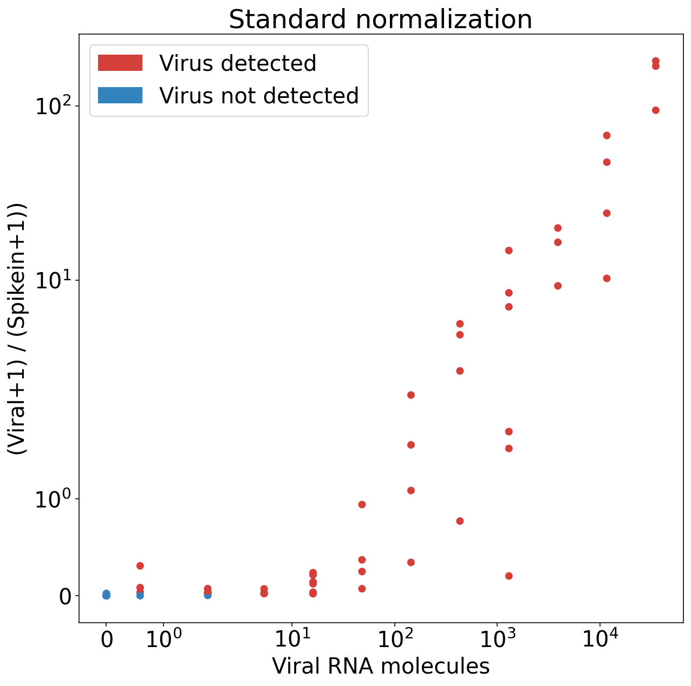
    


### Adjusted relative abundances

The logistic regression was performed on the log(X+1) counts and the train/test/split gives back matrices that are log(X+1). In order to make plotting nicer (ie loglog scale axis), we exponentiate the matrices. Given $X_l = \log(X+1)$  we wish to plot $\frac{(Y+1)^{w_2}}{(X+1)^{w_1}}$ vs the amount of Twist RNA. We can plot $\frac{(Y+1)^{w_2}}{(X+1)^{w_1}} = \frac{exp(Y_l)^{w_2}}{exp(X_l)^{w_1}}$ vs the amount of Twist RNA. 


```python
fig, ax = plt.subplots(figsize=(10, 10))

xlabel, ylabel = ("N1_spikein", "N1")
xidx, yidx = (np.where(data.var.gene.values==xlabel)[0][0], np.where(data.var.gene.values==ylabel)[0][0])

plot_LOD_adjusted(X_test, y_test, xlabel, ylabel, xidx, yidx, w, b, y_pred)

plt.show()
```


    
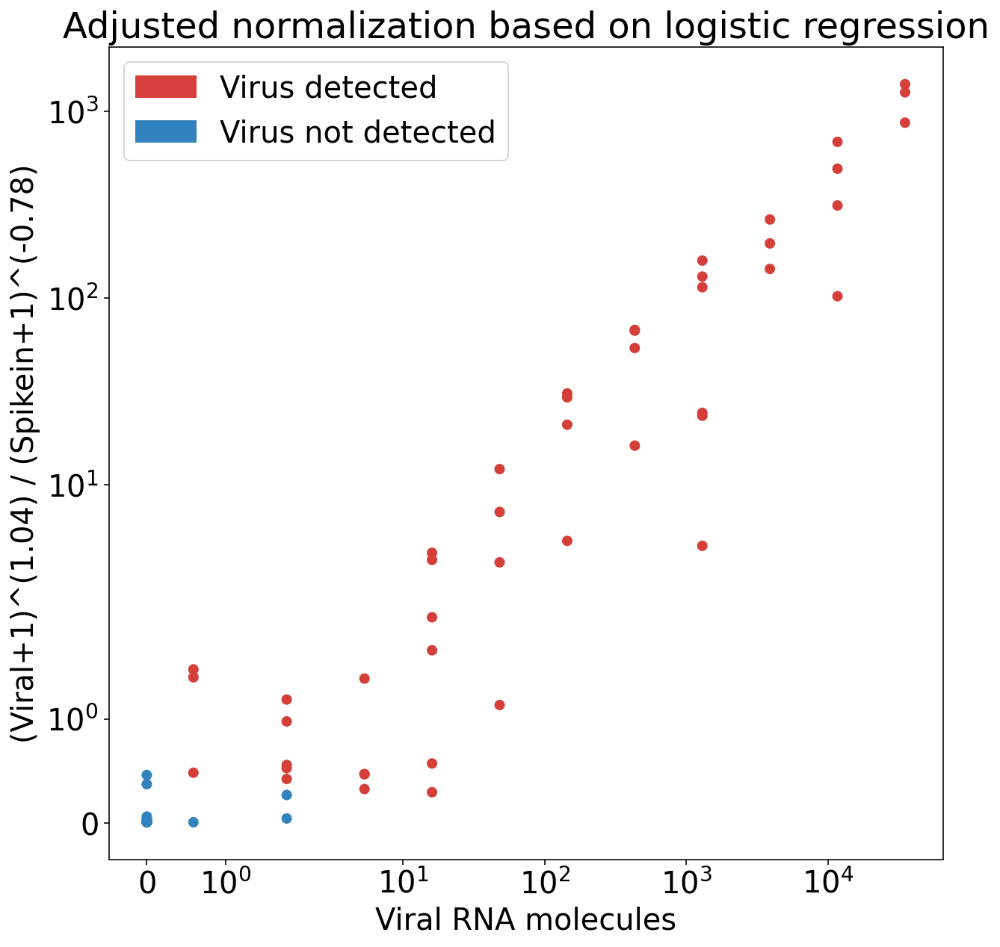
    


```python
print("Precision: {:,.4f}".format(metrics.precision_score(y_test[:,0], y_pred)))
print("Recall:    {:,.4f}".format(metrics.recall_score(y_test[:,0], y_pred)))
```

    Precision: 1.0000
    Recall:    0.9388


# Make these plots for all HEK experiments


```python
exp = [
        ("Plate1", "HEK293", "N1", "Twist"), 
        ("Plate1", "HEK293", "N1", "ATCC_RNA"),
        ("Plate2", "HEK293", "S2", "Twist"), 
        ("Plate2", "HEK293", "S2", "ATCC_RNA"),
]
```


```python
adata.var
```


<div>
<style scoped>
    .dataframe tbody tr th:only-of-type {
        vertical-align: middle;
    }

    .dataframe tbody tr th {
        vertical-align: top;
    }

    .dataframe thead th {
        text-align: right;
    }
</style>
<table border="1" class="dataframe">
  <thead>
    <tr style="text-align: right;">
      <th></th>
      <th>gene</th>
    </tr>
  </thead>
  <tbody>
    <tr>
      <th>0</th>
      <td>N1</td>
    </tr>
    <tr>
      <th>1</th>
      <td>N1_spikein</td>
    </tr>
    <tr>
      <th>2</th>
      <td>RPP30</td>
    </tr>
    <tr>
      <th>3</th>
      <td>S2</td>
    </tr>
    <tr>
      <th>4</th>
      <td>S2_spikein</td>
    </tr>
  </tbody>
</table>
</div>


```python
adata = adata[:,adata.var.sort_values("gene").index]
XXX = np.asarray(adata.layers["raw"])
plot_values = []
for (p, l, g, c) in exp:
    pmask = adata.obs.plate.values==p
    cmask = adata.obs[c+"_bool"].values
    lmask = adata.obs.lysate.values==l
    
    m = np.logical_and(np.logical_and(pmask, cmask), lmask)
    vm = np.logical_or(adata.var.gene.str.contains(g), adata.var.gene.str.contains("RPP30")).values
    gene_labels = adata.var.gene.values
    
    XX = XXX[m][:,vm]

    X = np.log1p(XX)
    y1 = nd((adata.obs[m][c]>0).astype(int))
    y2 = nd(adata.obs[m][c].values)

    print("{}\t{}\t{}\t{}".format(p, l, g[0], c))
    (X_train, X_test, y_train, y_test, y_pred, w, b, clf) = main(X, y1, y2)
    ##########################################################    
    fig, ax = plt.subplots(figsize=(15,10))

    xlabel, ylabel = (g+"_spikein", g)
    xidx, yidx = (np.where(gene_labels[vm]==xlabel)[0][0], np.where(gene_labels[vm]==ylabel)[0][0])
        
    plot(X_test, y_test, xidx, yidx, xlabel, ylabel, w, b, y_pred)
    ax.set_title("Classifier: {} {} {}".format(p, g[0], c))
    plt.savefig("./log_reg_{}_{}_{}.png".format(p, g, c),bbox_inches='tight', dpi=300)

    
    plt.show()
    ##########################################################
    fig, ax = plt.subplots(figsize=(10, 10))
    
    plot_LOD_normal(X_test, y_test, xlabel, ylabel, xidx, yidx, w, b, y_pred)
    ax.set_title("Standard curve: {} {} {}".format(p, g[0], c))
    #plt.savefig("./figs/lod_norm_{}_{}_{}.png".format(p, g, c),bbox_inches='tight', dpi=300)

    plt.show()
    ##########################################################
    fig, ax = plt.subplots(figsize=(10, 10))
    
    plot_LOD_adjusted(X_test, y_test, xlabel, ylabel, xidx, yidx, w, b, y_pred)
    ax.set_title("Adjusted standard curve: {} {} {}".format(p, g[0], c))
    #plt.savefig("./figs/lod_adj_{}_{}_{}.png".format(p, g, c),bbox_inches='tight', dpi=300)
    plt.show()
```

    Plate1	HEK293	N	Twist
    Score:     0.8333
    Precision: 0.7391
    Recall:    0.8947


    

    


    

    


    
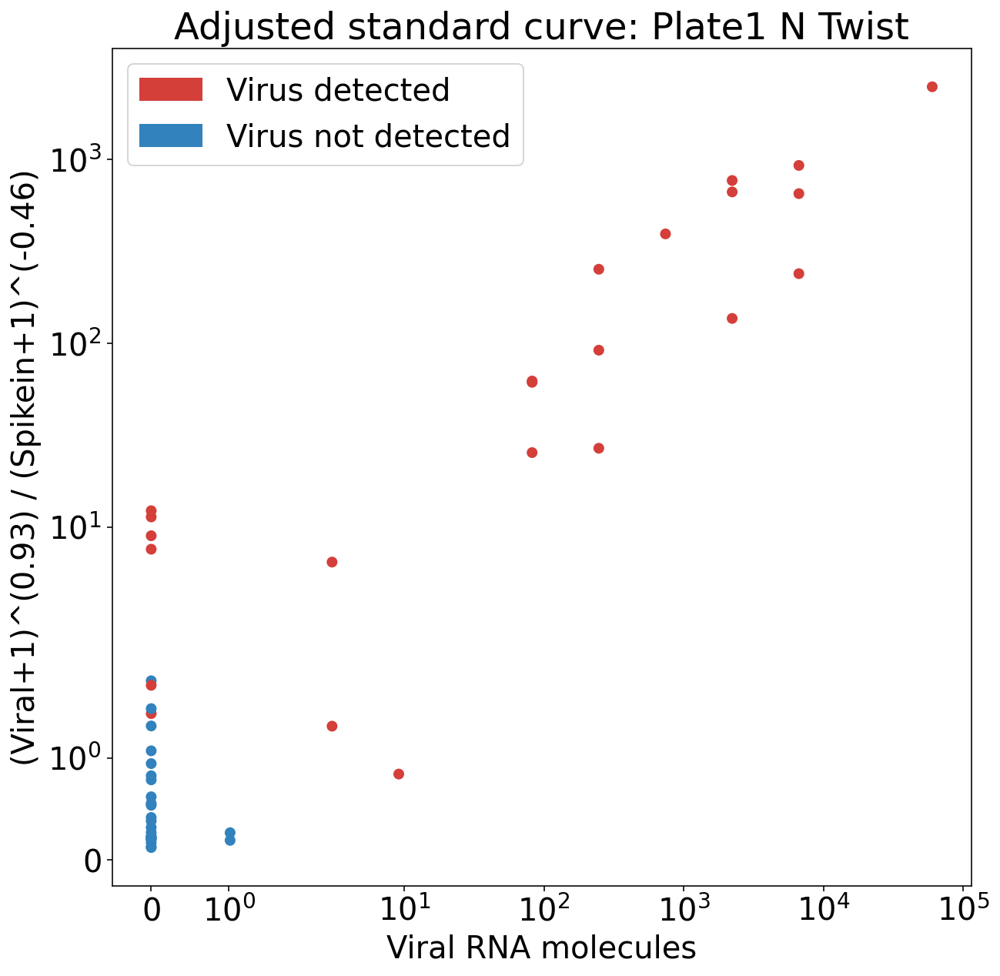
    


    Plate1	HEK293	N	ATCC_RNA
    Score:     0.9571
    Precision: 1.0000
    Recall:    0.9388


    
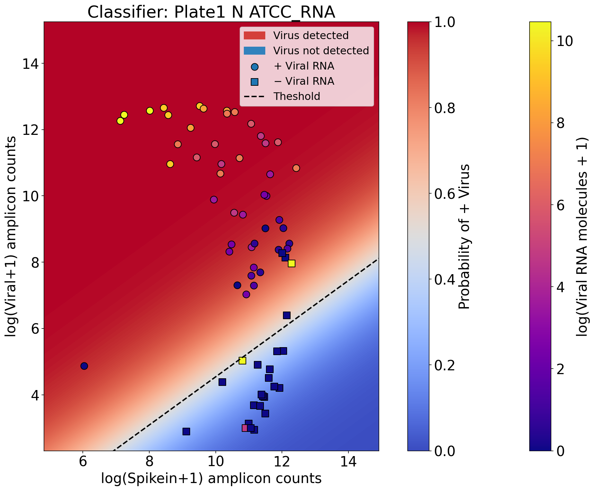
    


    
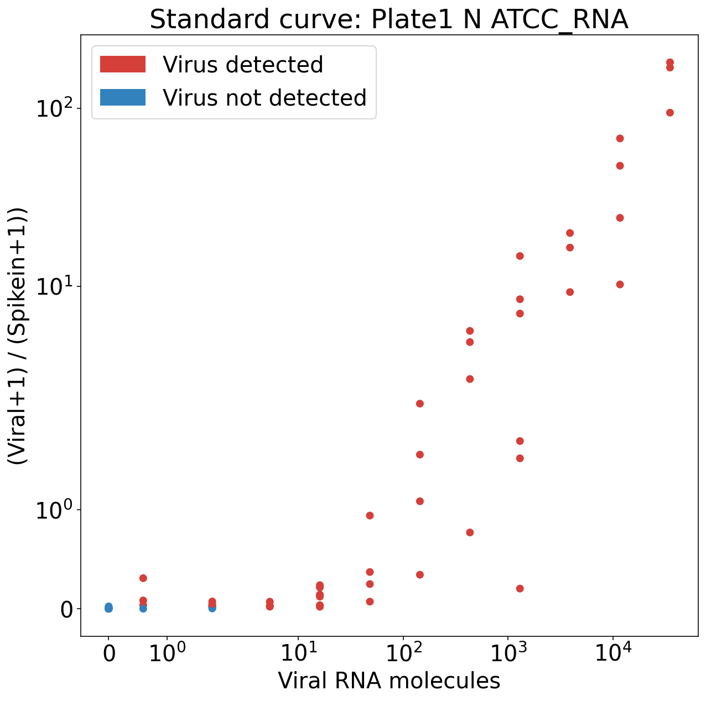
    


    
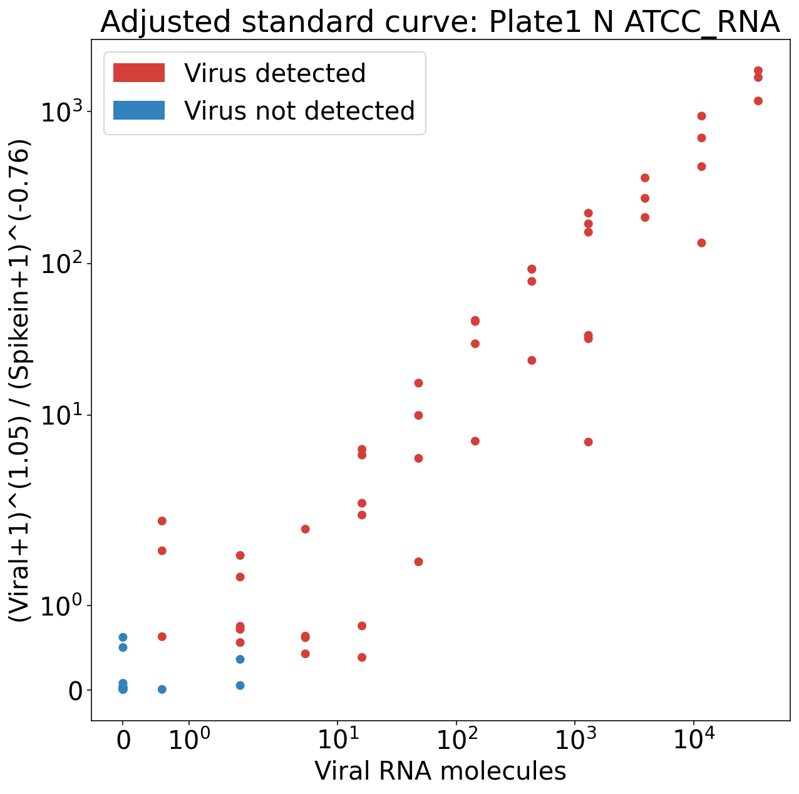
    


    Plate2	HEK293	S	Twist
    Score:     0.9375
    Precision: 0.9000
    Recall:    0.9474


    
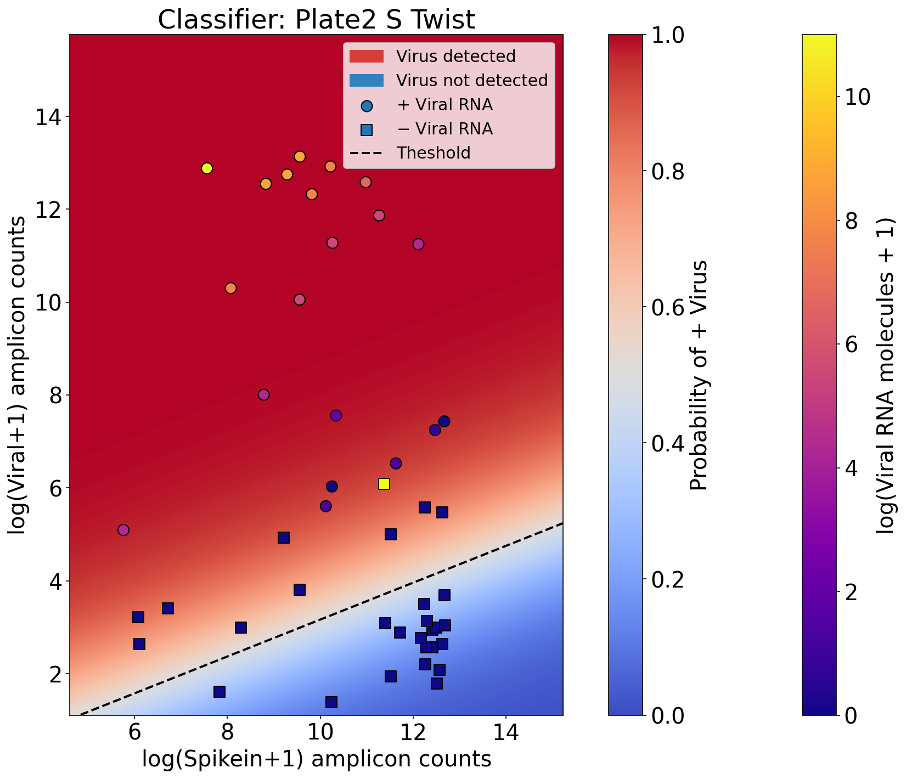
    


    
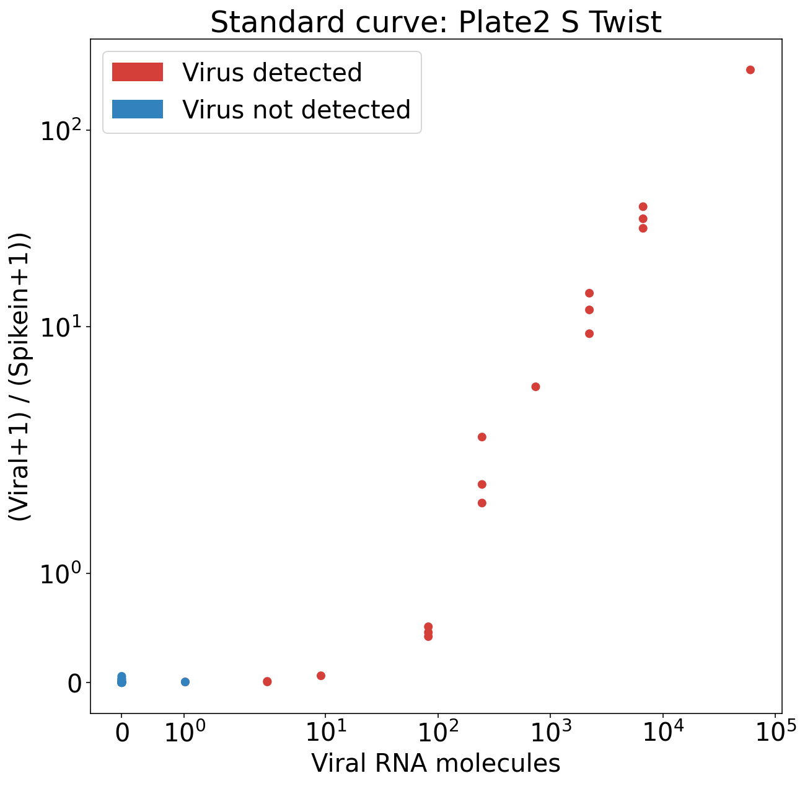
    


    
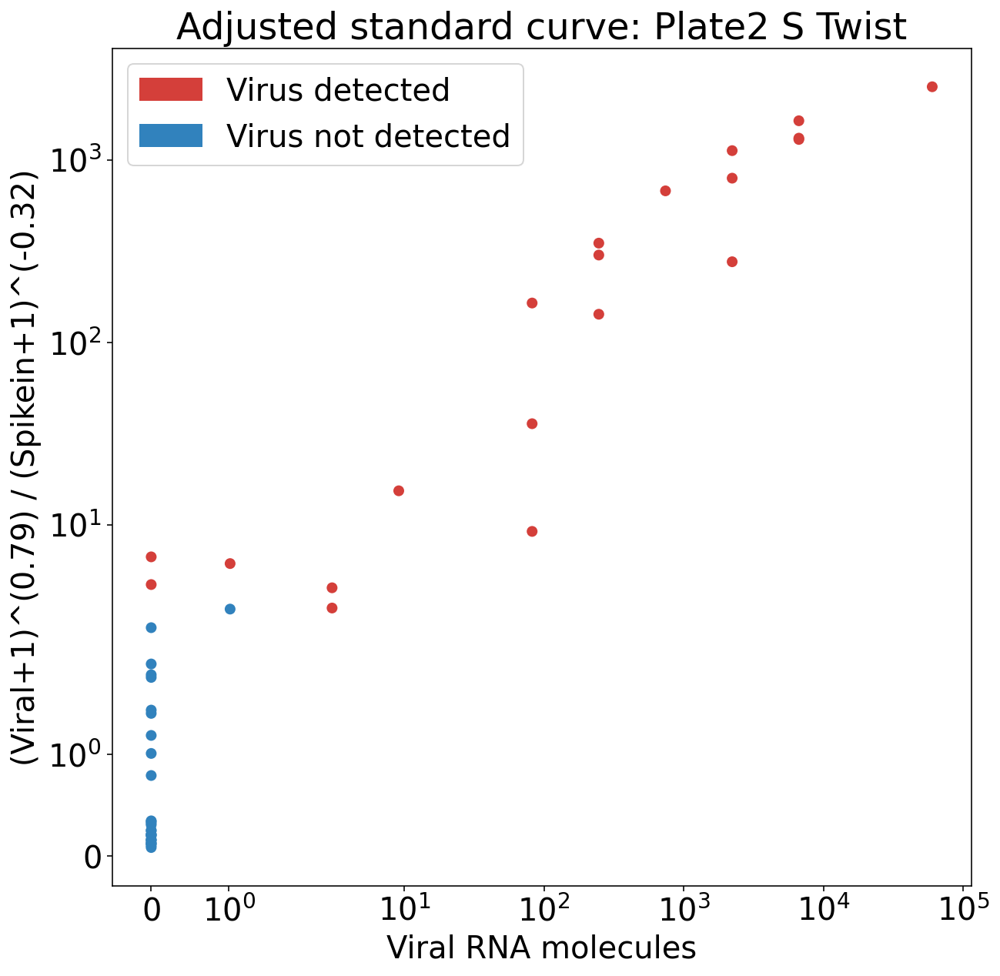
    


    Plate2	HEK293	S	ATCC_RNA
    Score:     0.8857
    Precision: 0.9767
    Recall:    0.8571


    
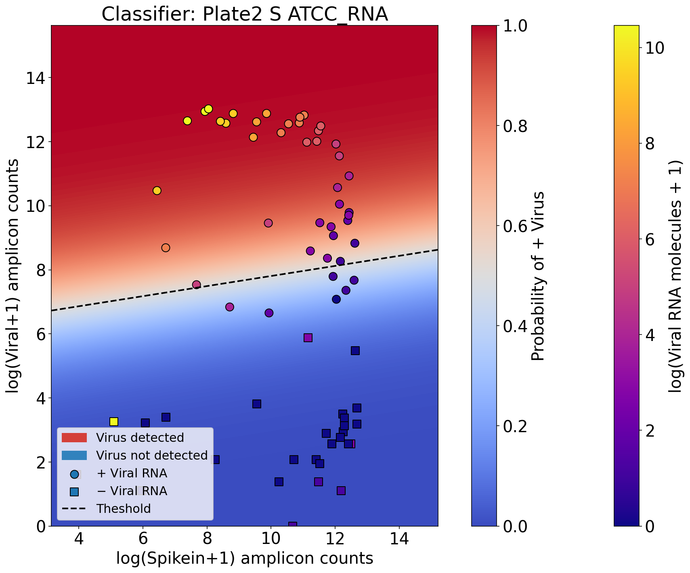
    


    
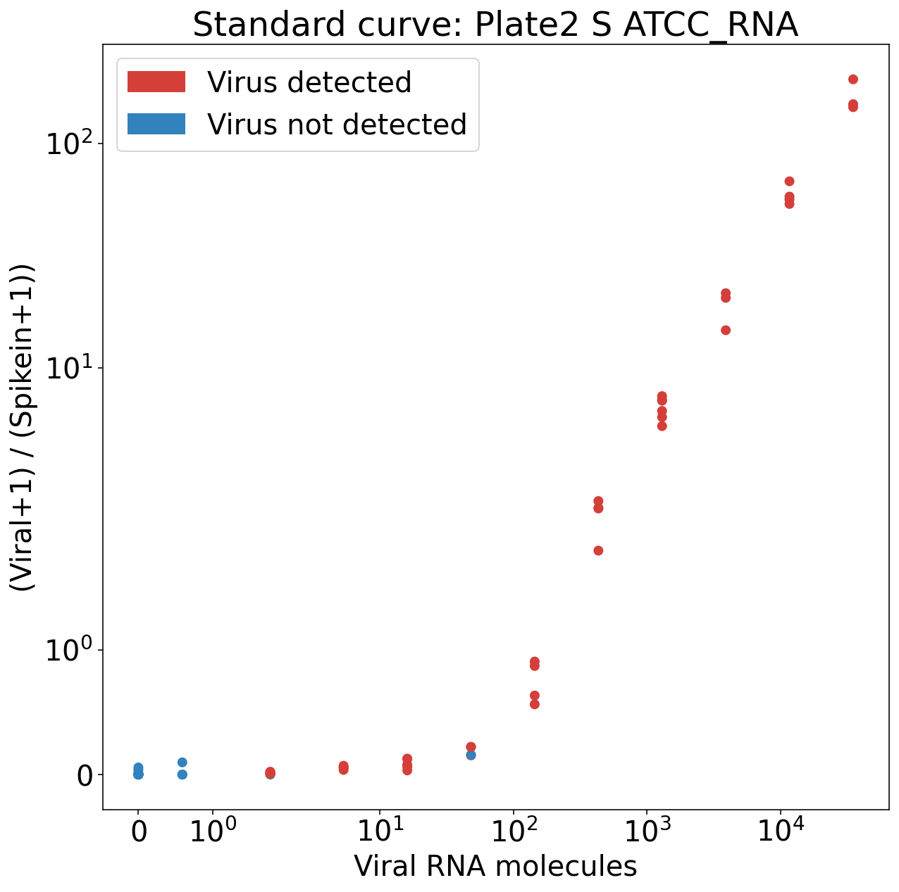
    


    
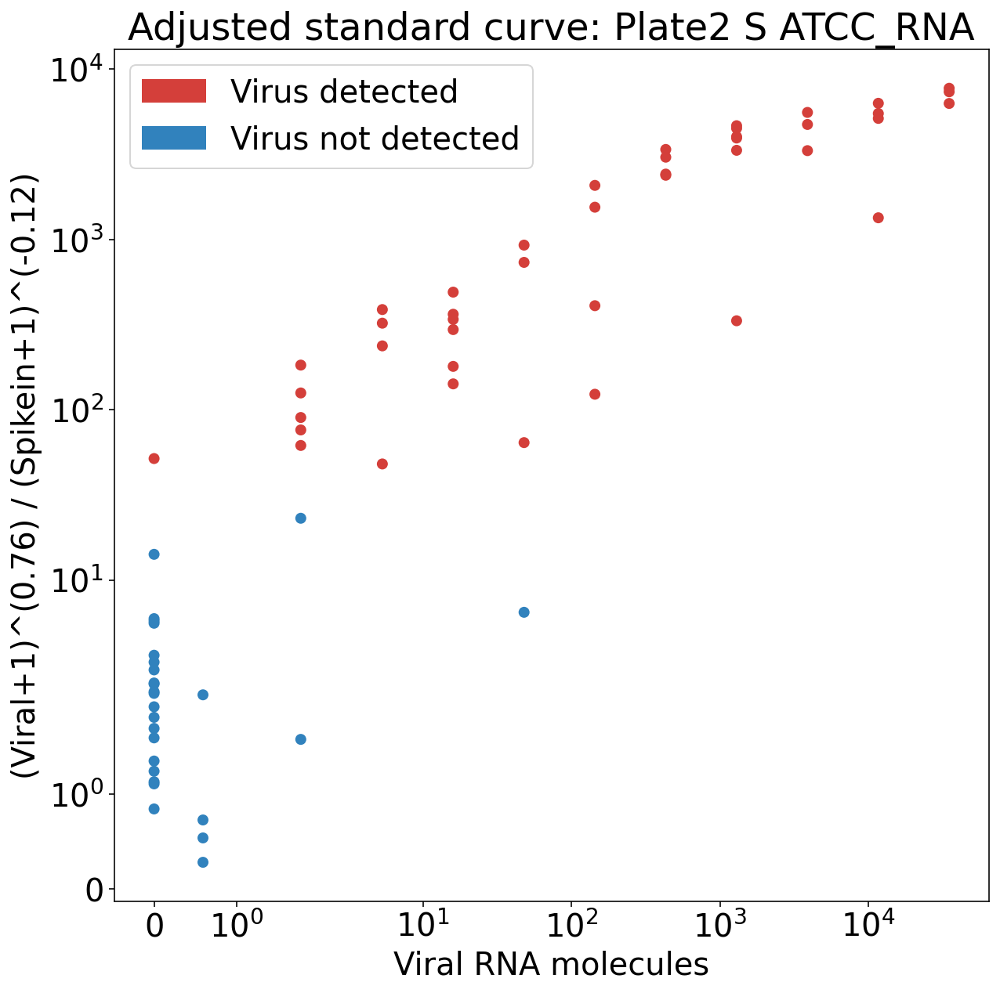
    


# Diagnostic results are reported as probabilities


```python
pd.DataFrame(clf.predict_proba(X_test), columns=["- virus", "+ virus"])
```


<div>
<style scoped>
    .dataframe tbody tr th:only-of-type {
        vertical-align: middle;
    }

    .dataframe tbody tr th {
        vertical-align: top;
    }

    .dataframe thead th {
        text-align: right;
    }
</style>
<table border="1" class="dataframe">
  <thead>
    <tr style="text-align: right;">
      <th></th>
      <th>- virus</th>
      <th>+ virus</th>
    </tr>
  </thead>
  <tbody>
    <tr>
      <th>0</th>
      <td>0.988534</td>
      <td>0.011466</td>
    </tr>
    <tr>
      <th>1</th>
      <td>0.005457</td>
      <td>0.994543</td>
    </tr>
    <tr>
      <th>2</th>
      <td>0.975508</td>
      <td>0.024492</td>
    </tr>
    <tr>
      <th>3</th>
      <td>0.005474</td>
      <td>0.994526</td>
    </tr>
    <tr>
      <th>4</th>
      <td>0.057123</td>
      <td>0.942877</td>
    </tr>
    <tr>
      <th>...</th>
      <td>...</td>
      <td>...</td>
    </tr>
    <tr>
      <th>65</th>
      <td>0.003317</td>
      <td>0.996683</td>
    </tr>
    <tr>
      <th>66</th>
      <td>0.053892</td>
      <td>0.946108</td>
    </tr>
    <tr>
      <th>67</th>
      <td>0.119947</td>
      <td>0.880053</td>
    </tr>
    <tr>
      <th>68</th>
      <td>0.305283</td>
      <td>0.694717</td>
    </tr>
    <tr>
      <th>69</th>
      <td>0.020065</td>
      <td>0.979935</td>
    </tr>
  </tbody>
</table>
<p>70 rows × 2 columns</p>
</div>


```python

```
